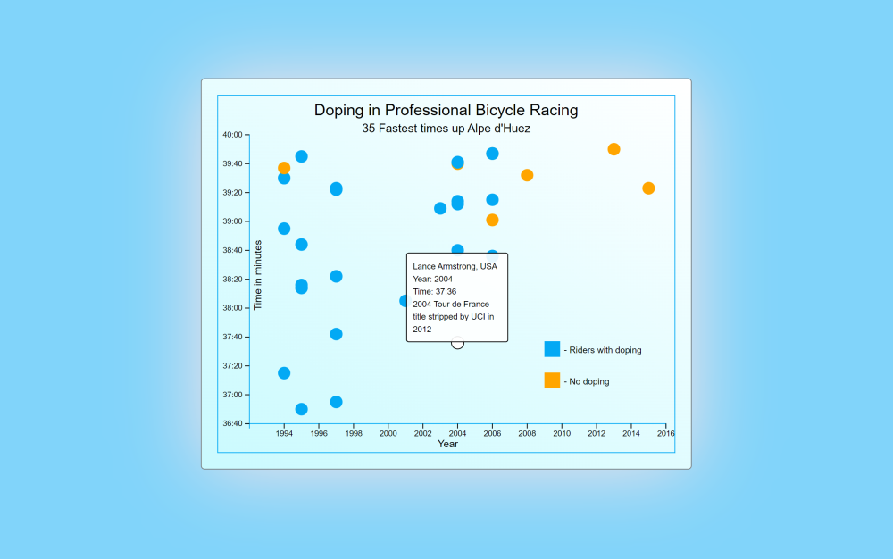

# [freeCodeCamp Data Visualization certification](https://www.freecodecamp.org/learn/data-visualization/)

## [Visualize Data with a Scatterplot Graph project]()

Working example: https://raff1010x.github.io/18.Data-Visualization-Projects--Visualize-Data-with-a-Scatterplot-Graph/

My git repo: https://github.com/Raff1010X/01.Roadmap

